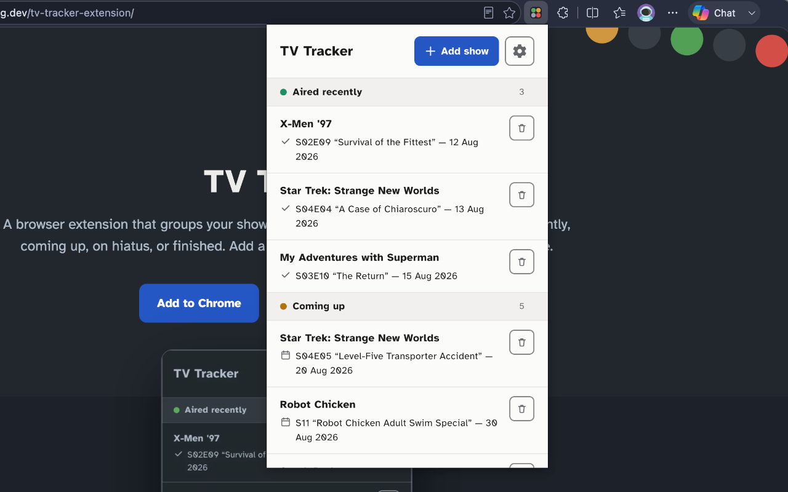

# TV Tracker

A browser extension for tracking TV shows. See when each show last aired and when it is next on.

[Website](https://www.karlhorning.dev/tv-tracker-extension/) · [Privacy Policy](https://www.karlhorning.dev/tv-tracker-extension/privacy.html) · [Support me on Ko-fi](https://ko-fi.com/karlhorning)

## Screenshots and demo



<a href="https://chromewebstore.google.com/detail/tv-tracker/pfadihbpjelibobconkadcpfljgjpelp"></a>
<a href="https://microsoftedge.microsoft.com/addons/detail/tv-tracker/mdeanpnjihfdlpfmoepfjfbkdkdkcpjf"></a>

## Features

- **Status Board** — shows are grouped into four sections: Aired recently, Coming up, On hiatus, and No upcoming episode. A show can appear in more than one section at the same time.
- **Search** — search the TVmaze database to add shows by title.
- **Background refresh** — show data updates automatically every four hours.
- **Sort** — order tracked shows by title or air date, ascending or descending.
- **Import and export** — back up your tracked shows to a JSON file, or restore them on another browser.
- **Remove** — remove a show from your list at any time, with a confirmation prompt first.
- **Light and dark mode** — switch anytime from Settings. Follows your system preference until you choose one explicitly.

## Tech stack

- [TypeScript](https://www.typescriptlang.org/)
- [Vite](https://vitejs.dev/)
- [Vitest](https://vitest.dev/)
- [axe-core](https://github.com/dequelabs/axe-core) (automated accessibility testing)
- [ESLint](https://eslint.org/) with [typescript-eslint](https://typescript-eslint.io/)'s type-checked rules
- [TVmaze public API](https://www.tvmaze.com/api)

## Notable decisions

- **Imported shows always refetch fresh data** — a backup file only stores show IDs and names, not episode data. Restoring from it re-fetches each show from TVmaze rather than trusting a snapshot that may be out of date.
- **Storage writes are batched, not per-show** — `chrome.storage.local` reads and writes aren't atomic. Adding or refreshing several shows with one write per show raced and silently dropped entries under concurrent calls; everything now goes through a single read-modify-write per batch.
- **Delete uses the native confirm() dialogue** — simpler and just as accessible as a custom modal.
- **Every colour pair meets WCAG AA contrast minimums** — 4.5:1 for text, 3:1 for interactive boundaries like borders and buttons, in both the light and dark themes.
- **Dark mode is calibrated, not inverted from light mode** — background and text tones avoid the glare of a near-black/near-white pairing, the same principle already used in light mode.
- **Settings live in a native `<details>` menu** — fully keyboard-operable with Tab, Enter, and Escape.
- **The landing page hero's buttons use fixed colours, not the shared `--blue` token** — `--blue` is intentionally lighter in dark mode for text and link legibility, but the hero background stays dark regardless of page theme. Reusing the token as a solid button fill dropped white button text below WCAG contrast in dark mode.
- **ESLint uses typescript-eslint's type-checked rules, not just syntax rules** — it caught several async event listeners passed directly to `addEventListener`/`setTimeout`, a real unhandled-rejection risk rather than a style nit. It also required adding `tsconfig.docs.json`, since `docs/*.test.ts` sat outside every tsconfig and was never type-checked by `npm run build`.
- **Import runs in its own window, not a hidden file input inside the popup** — Firefox closes the popup the instant a file input opens inside it, so importing there silently did nothing. A separate window avoids that bug. It also keeps the import experience identical across every browser, rather than treating Firefox as a special case.
- **No "mark as watched" feature** — TV Tracker is a TV guide, not a watch-tracking checklist. It tells you what aired and what's coming up; keeping track of what you've actually seen is a different job.

## Local development

```bash
git clone https://github.com/Karl-Horning/tv-tracker-extension.git
cd tv-tracker-extension
npm install
npm run build
```

Then load the extension in Chrome:

1. Go to `chrome://extensions`
2. Enable **Developer mode**
3. Click **Load unpacked** and select the `dist/` folder

Or in Firefox:

1. Go to `about:debugging#/runtime/this-firefox`
2. Click **Load Temporary Add-on…**
3. Select `dist/manifest.json`

Firefox removes temporary add-ons on restart, so you'll need to reload it each session.

## Scripts

| Command              | Description                                                                       |
| -------------------- | --------------------------------------------------------------------------------- |
| `npm run build`      | Type-check and compile to `dist/`                                                 |
| `npm run dev`        | Start the Vite dev server                                                         |
| `npm run docs:serve` | Serve the docs page locally over HTTP (needed for ES module scripts to load)      |
| `npm run lint`       | Lint the whole project                                                            |
| `npm run package`    | Build and zip store submission packages into `release/` (Chrome/Edge and Firefox) |
| `npm test`           | Run all tests once                                                                |
| `npm run test:watch` | Run tests in watch mode                                                           |

## Feedback and issues

Found a bug or have a suggestion? [Open an issue](https://github.com/Karl-Horning/tv-tracker-extension/issues).

## Design

Source design files are in `design/` and were created in [Affinity](https://www.affinity.studio/graphic-design-software).

Built with [Claude](https://claude.ai) as an AI coding assistant. Architecture, decisions, testing, and the writing voice throughout are mine.

## License

Released under the [MIT License](./LICENSE) by [Karl Horning](https://github.com/Karl-Horning).
